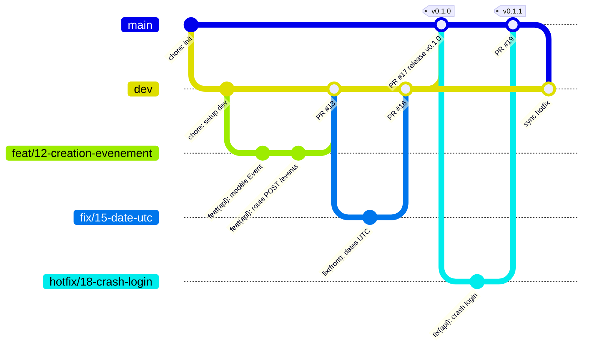

# Workflow Git - EventHub

## Branches

| Branche               | Rôle                       | Durée de vie | Protégée | Merge vers     |
| --------------------- | -------------------------- | ------------ | -------- | -------------- |
| `main`                | Production (code déployé)  | Permanente   | Oui      | -              |
| `dev`                 | Intégration                | Permanente   | Oui      | `main`         |
| `feat/<id>-<sujet>`   | Nouvelle fonctionnalité    | Éphémère     | Non      | `dev`          |
| `fix/<id>-<sujet>`    | Correction                 | Éphémère     | Non      | `dev`          |
| `hotfix/<id>-<sujet>` | Correction urgente en prod | Éphémère     | Non      | `main` + `dev` |

`<id>` = numéro de l'issue GitHub (ex. `feat/12-creation-evenement`).

## Schéma



Version texte :

```
feat/* ──┐
fix/*  ──┼──► dev ──(PR release)──► main ──► prod
         │                           ▲
hotfix/* ┴───────────────────────────┘  (puis main ──► dev)
```

## Cycle de travail

1. Partir de `dev` à jour : `git switch dev && git pull`
2. Créer la branche : `git switch -c feat/12-creation-evenement`
3. Commits au format Conventional Commits (vérifiés par Husky)
4. `git push -u origin feat/12-creation-evenement` puis ouvrir une PR vers `dev`, avec `Closes #12`
5. Review, merge (squash), suppression de la branche
6. Release : PR `dev` → `main`, tag `vX.Y.Z`

## Règles de protection

| Règle                                   | `main` | `dev` |
| --------------------------------------- | ------ | ----- |
| Push direct interdit (PR obligatoire)   | Oui    | Oui   |
| Approbations requises                   | 1      | 0     |
| Approbations invalidées si nouveau push | Oui    | Non   |
| Conversations résolues avant merge      | Oui    | Oui   |
| Historique linéaire                     | Oui    | Non   |
| Force push interdit                     | Oui    | Oui   |
| Suppression interdite                   | Oui    | Oui   |

Application : `./protect-branches.sh <owner>/eventhub` ou manuellement dans **Settings > Branches > Add classic branch protection rule**.
